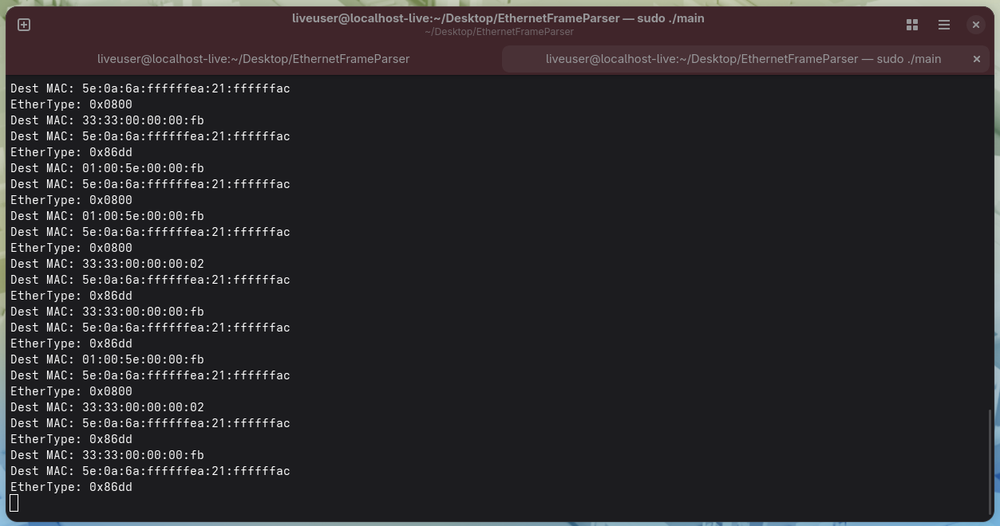

# EthernetFrameParser

I built this to learn how Ethernet frames actually work at the byte level. It reads raw frames off a Linux TAP interface and pulls apart the headers — destination MAC, source MAC, and EtherType.

## How it works

The program creates a virtual TAP network interface, then sits in a loop reading frames as they come in. Each frame gets its 14-byte Ethernet header parsed and printed to the terminal. Nothing fancy, just raw byte manipulation with structs and pointer casting.

The TAP device gives us full Layer 2 frames (not just IP packets like TUN would), so we get the actual MAC addresses and can see whether traffic is IPv4, IPv6, ARP, etc.

## Output



You can see it picking up both IPv4 (`0x0800`) and IPv6 (`0x86dd`) traffic, including multicast frames (`33:33:...` and `01:00:5e:...` prefixes).

## Build & run

```bash
make
sudo ./ethparser
```

Then in another terminal:

```bash
sudo ip link set tap0 up
sudo ip addr add 192.168.1.1/24 dev tap0
ping 192.168.1.2
```

Needs root because TAP devices require it.

## Files

- `main.c` — opens the TAP device, runs the read loop, passes frames to the parser
- `tap.c` / `tap.h` — handles TAP device setup (open, read, write, close)
- `ethernet.c` / `ethernet.h` — parses the Ethernet header and prints it
- `Makefile` — just a simple gcc build

## EtherTypes I've seen so far

- `0x0800` — IPv4
- `0x0806` — ARP
- `0x86dd` — IPv6
